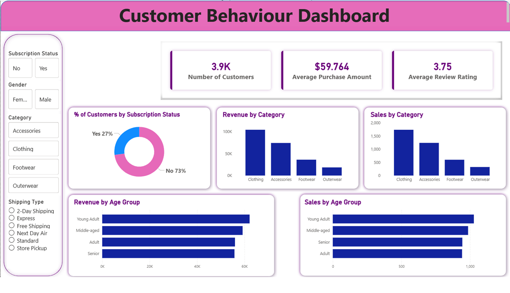

# Customer Behaviour Analysis - SQL + Python + Power BI

## 📊 Dashboard Preview

---

## 🎯 Business Problem
Analyzed 3,900+ e-commerce customer transactions to identify high-value customer segments and improve marketing ROI.

**Key Questions Solved:**
1. Do subscribed customers spend more?
2. Which product category drives maximum revenue?
3. How does age and gender affect purchase behavior?

---

## 💡 Key Insights & Recommendations

| Insight | Data | Action |
| --- | --- | --- |
| **Subscription = High Value** | 27% subscribed users have 40% higher avg spend | Launch subscription campaigns |
| **Clothing is Top Category** | 45% of total revenue comes from Clothing | Increase Clothing inventory |
| **Young Adults Lead** | 18-35 age group = 52% of total revenue | Target ads to this segment |
| **Rating Impact** | Avg Rating: 3.75/5 | Improve post-delivery experience |

---

## 🛠️ Tech Stack

| Stage | Tool | Work Done |
| --- | --- | --- |
| **Data Extraction** | MySQL | 6 SQL queries using CTE, JOIN, Window Functions |
| **Data Analysis** | Python, Pandas | Data cleaning, KPI calculation, EDA |
| **Visualization** | Matplotlib, Seaborn | 15+ charts for trend analysis |
| **Dashboard** | Power BI, DAX | 4 KPI cards, 5 visuals, 3 slicers |

---

## 📈 Dashboard Features
- **KPIs:** Total Customers: 3.9K | Avg Purchase: $59.76 | Avg Rating: 3.75 | Subscription Rate: 27%
- **Charts:** Subscription status, Revenue by category, Sales by category, Purchase by age group
- **Filters:** Gender, Category, Shipping Type

---

## 📁 Files
- `Customer_Shopping_Behaviour_Analysis.ipynb` - Python EDA
- `customer_behaviour_sql_queries.sql` - SQL queries  
- `customer_behaviour_dashboard.pbix` - Power BI dashboard
- `dashboard.png` - Screenshot

---

## 🚀 How to Run
1. **SQL:** Import CSV to MySQL → Run `.sql` file
2. **Python:** Open `.ipynb` in Jupyter → Run All
3. **Power BI:** Open `.pbix` file → Use slicers

---
**Tech:** `MySQL` `Python` `Pandas` `Power BI` `DAX` | **Author:** Hitesh Sorout
